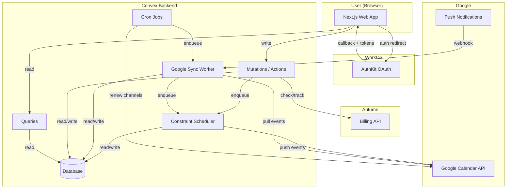
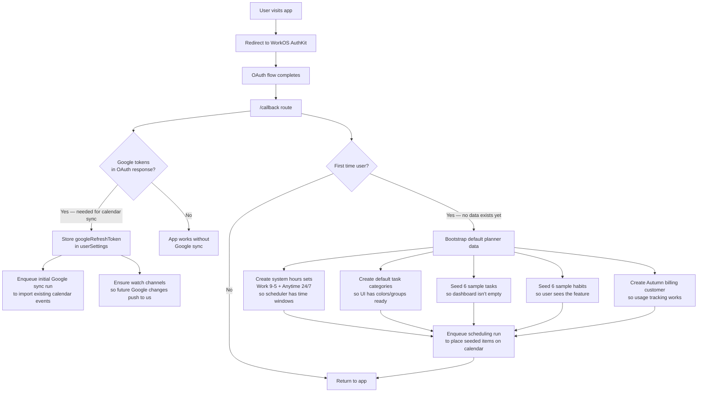
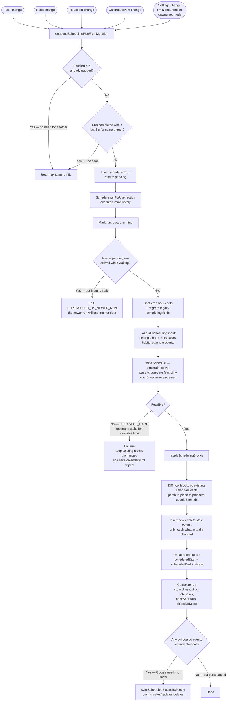
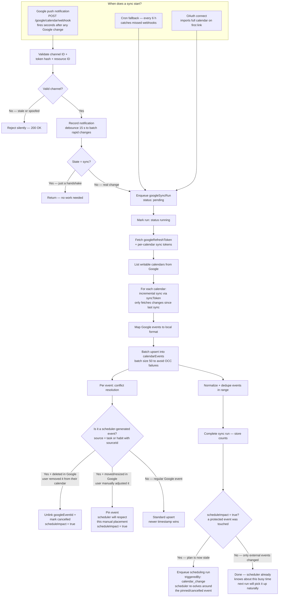
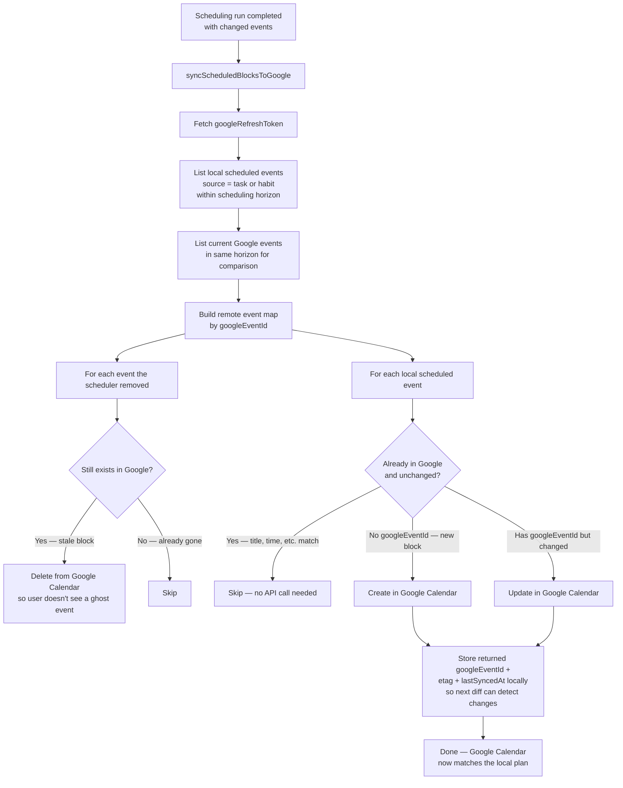
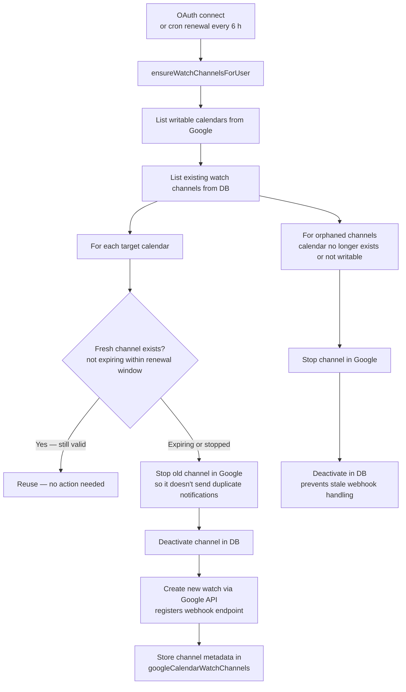
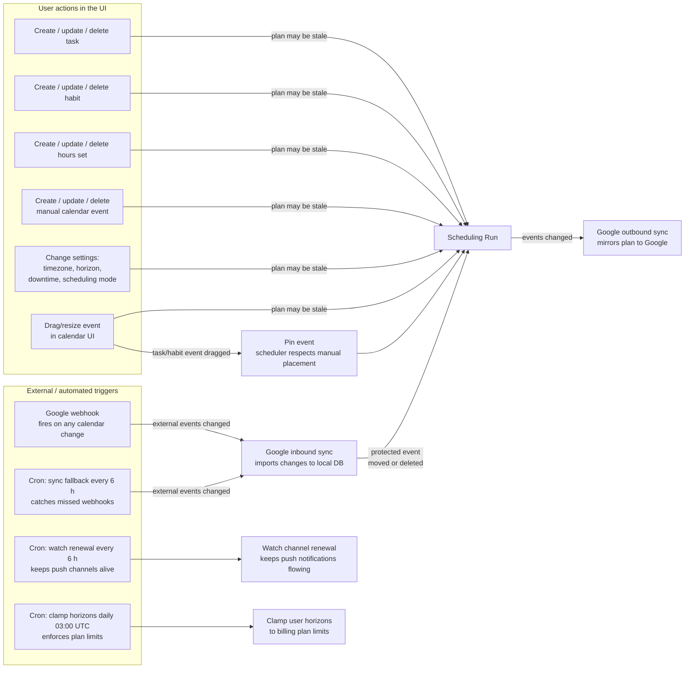

# Architecture

## Features

- Task and habit planning with explicit priorities and durations
- Reusable per-user hours sets (`Work`, `Anytime (24/7)`, and custom sets)
- Task scheduling mode intent (`fastest`, `balanced`, `packed`) with global default + per-task override
- Habit recurrence canonical source (`recurrenceRule` / RRULE) with `recoveryPolicy` (`skip` or `recover`)
- Tasks and habits dashboard UIs with create/edit/delete/toggle flows
- Constraint-based auto-scheduling into available calendar slots (15-minute discretization)
- Scheduling run tracking for observability and debugging
- Calendar event model with multi-source support (`manual`, `google`, `task`, `habit`)
- Billing integration via Autumn with create-only metering for `tasks` and `habits`
- Scheduling remains unlimited across all plans (no scheduling metering)
- WorkOS-based authentication and user identity flow

## Monorepo Structure

```text
auto-cron/
|- apps/
|  |- web/                     # Next.js 15 web app
|  |- mobile/                  # Planned Expo app
|  \- desktop/                 # Planned desktop app
|- convex/                     # Convex backend (schema, auth config, http router)
|- packages/
|  |- types/                   # Shared domain types
|  \- config/                  # Shared config packages
\- docs/                       # Project docs
```

## Stack

| Layer | Technology |
|-------|------------|
| Web Frontend | Next.js 15, React 19, Tailwind CSS 4 |
| Backend | Convex |
| Auth | WorkOS AuthKit (scaffolded) |
| Billing | Autumn |
| Build & Monorepo | Turbo + Bun workspaces |
| Code Quality | Biome + TypeScript |

## Core Data Model

Defined in `convex/schema.ts`:

- `userSettings` — per-user preferences, Google tokens, timezone, scheduling config
- `tasks` — task definitions with priority, deadline, duration, scheduling metadata
- `habits` — habit definitions with recurrence rules and recovery policy
- `hoursSets` — reusable time-window sets that control when tasks/habits can be scheduled
- `taskCategories` — user-defined categories with colors for tasks and habits
- `calendarEvents` — individual event occurrences from any source (manual, google, task, habit)
- `calendarEventSeries` — shared metadata for recurring event series
- `googleCalendarWatchChannels` — active Google push notification channel registrations
- `googleSyncRuns` — tracks lifecycle of each Google Calendar sync operation
- `schedulingRuns` — tracks lifecycle and diagnostics of each constraint-solver run
- `billingReservations` — transactional billing state for task/habit creation
- `billingLocks` — per-user/per-feature locks to serialize billable operations

## System Flowcharts

### High-level overview

The system has four external boundaries: the user's browser, WorkOS (auth), Google Calendar (bidirectional sync), and Autumn (billing). All domain logic runs inside Convex. The core loop is: user changes data → scheduler recomputes the plan → changed events push to Google → Google changes pull back in and may re-trigger the scheduler.



### Authentication & onboarding

**When:** A user visits the app for the first time or signs in again.

**Why:** WorkOS handles identity so we don't store passwords. The callback is also where we capture the Google OAuth refresh token — without it, calendar sync can't work. New users get seeded with default hours sets, sample tasks/habits, and a billing customer so every downstream feature has data to work with immediately.



### Task & habit lifecycle

**When:** Any time the user creates, edits, deletes, or reorders a task or habit from the UI.

**Why:** Every data change that could affect the calendar plan must trigger a scheduling run so the plan stays current. Creates are the only billable operation — Autumn enforces plan limits. Updates and deletes are ungated (auth + ownership only) because the user already paid for the entity. Moving a task to backlog unpins its calendar events so the scheduler reclaims those slots.

```mermaid
flowchart TD
    subgraph Create["Create — only billable operation"]
        C1[UI calls createTask / createHabit action]
        C1 --> C2[Acquire billing lock\nserializes concurrent creates per user]
        C2 --> C3{Autumn check:\nplan limit reached?}
        C3 -->|Yes| C3a[Throw FEATURE_LIMIT_REACHED\nUI shows upgrade prompt]
        C3 -->|No| C4[Create billing reservation\ntracks in-flight operation]
        C4 --> C5[Insert task/habit into DB]
        C5 --> C6[Track usage via Autumn\nidempotent by operationKey]
        C6 -->|Success| C7[Commit reservation]
        C6 -->|Failure| C8[Rollback — delete entity\nuser sees no partial state]
        C7 --> C9[Release lock]
        C8 --> C9
        C5 --> C10[Enqueue scheduling run\nnew item needs calendar placement]
    end

    subgraph Update["Update — ungated"]
        U1[UI calls updateTask / updateHabit]
        U1 --> U2[Validate ownership]
        U2 --> U3[Patch entity in DB]
        U3 --> U4{Changed priority, duration,\ndeadline, hours set, or status?}
        U4 -->|Yes — affects placement| U5[Enqueue scheduling run]
        U4 -->|No — cosmetic change| U6[Done — no reschedule needed]
    end

    subgraph Delete["Delete — ungated"]
        D1[UI calls deleteTask / deleteHabit]
        D1 --> D2[Validate ownership]
        D2 --> D3[Delete entity from DB]
        D3 --> D4[Enqueue scheduling run\nfrees up calendar slots]
    end

    subgraph StatusChange["Task status transitions"]
        S1[User moves task to\nbacklog / queued / done]
        S1 --> S2{Moving to backlog?}
        S2 -->|Yes — user deprioritized it| S3[Unpin all calendar events\nso scheduler reclaims those slots]
        S2 -->|No| S4{Moving to done?}
        S4 -->|Yes| S5[Set completedAt\nscheduler stops placing it]
        S3 & S4 & S5 --> S6[Enqueue scheduling run\nplan needs to reflect new status]
    end
```



### Scheduling pipeline

**When:** Enqueued by any mutation that changes tasks, habits, hours sets, calendar events, or scheduling-relevant settings (timezone, horizon, downtime, mode).

**Why:** The scheduler is the core of auto-cron — it turns a pile of tasks, habits, and time constraints into a concrete calendar plan. It debounces (3 s window) to avoid redundant runs when the user makes rapid edits. It supersedes stale runs so only the latest state gets solved. After placing events locally, it pushes changes to Google so the user's external calendar stays in sync.



### Google Calendar sync — inbound (pull)

**When:** Triggered by three sources: (1) Google push notification webhook — fires within seconds of any change in the user's Google Calendar, (2) cron fallback every 6 hours — catches anything webhooks missed, (3) OAuth connect — imports the user's full calendar on first link.

**Why:** The scheduler needs to know about external busy time (meetings, appointments) to avoid double-booking. Inbound sync also detects when a user moves or deletes a scheduler-generated event in Google — moved events get pinned (respected as-is), deleted events get cancelled and trigger rescheduling so the task/habit gets a new slot.



### Google Calendar sync — outbound (push)

**When:** Immediately after a scheduling run completes, but only if the solver actually changed any calendar events.

**Why:** The scheduler writes task/habit blocks to the local `calendarEvents` table, but the user's Google Calendar doesn't know about them yet. This step mirrors the local plan to Google so the user sees their scheduled blocks alongside their existing meetings. It diffs against what's already in Google to minimize API calls — unchanged events are skipped entirely.



### Watch channel lifecycle

**When:** Channels are created on OAuth connect (so push notifications start immediately) and renewed by a cron every 6 hours (Google watch channels expire after ~7 days).

**Why:** Without watch channels, the only way to detect Google Calendar changes would be polling. Push notifications let us react within seconds. Each writable calendar gets its own channel. When a user removes a calendar from their Google account, the orphaned channel is stopped to avoid wasted webhook traffic.



### Trigger chain — what causes what and why

This diagram shows the complete cause-and-effect chain across the system. The key feedback loop: user actions trigger scheduling, scheduling pushes to Google, Google changes pull back in, and if a protected event was touched, scheduling runs again.



## Architecture principle

Provider-specific logic should stay isolated behind adapter boundaries.

- Auth provider concerns belong in auth integration layers (`convex/auth.config.ts`, web auth wrappers).
- Billing provider concerns belong in Autumn-specific modules (`convex/autumn.ts`, `autumn.config.ts`, web API adapter).
- Business logic should not depend directly on provider SDK details.
